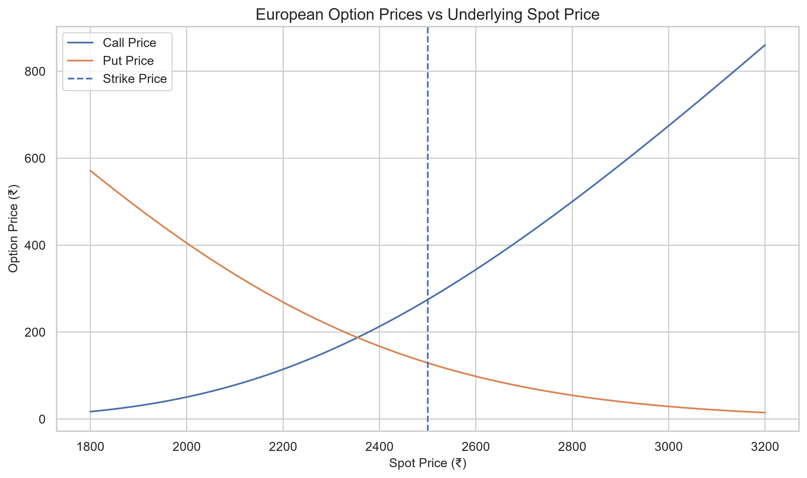
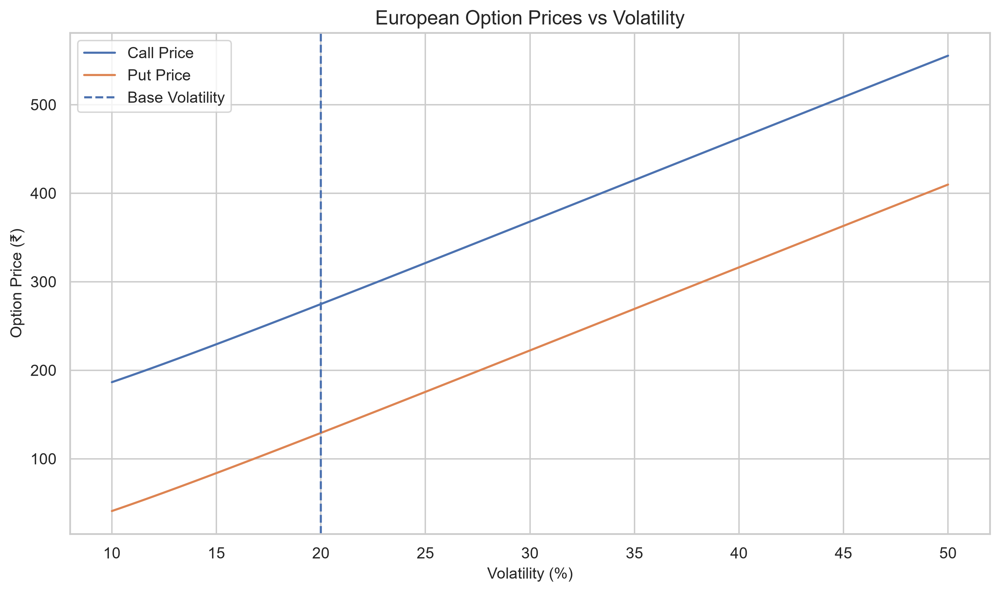
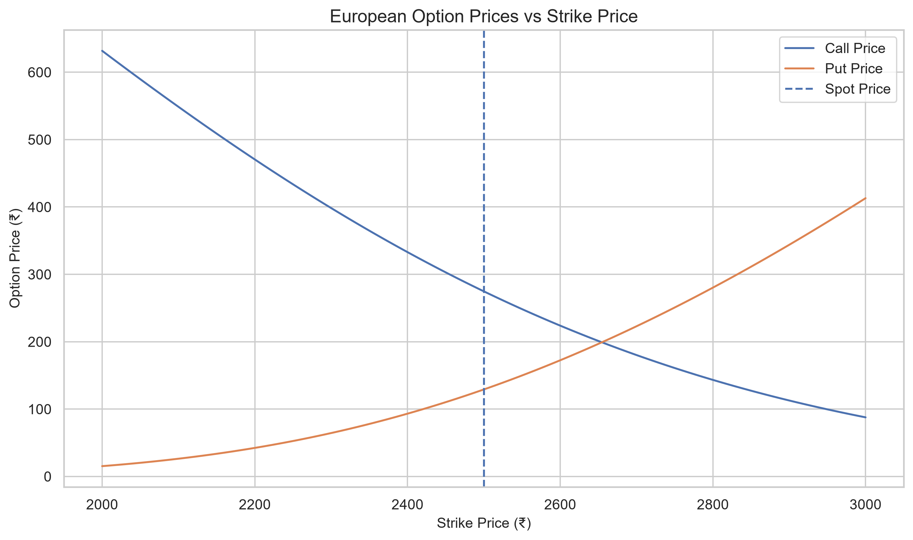
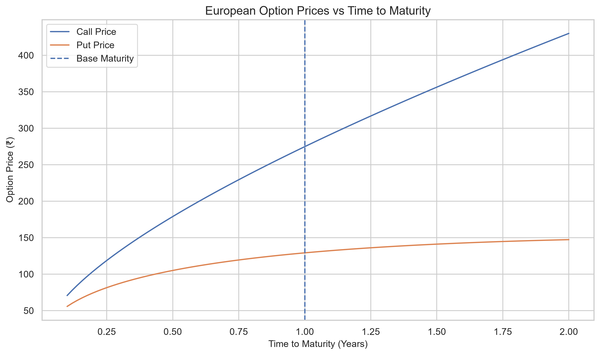
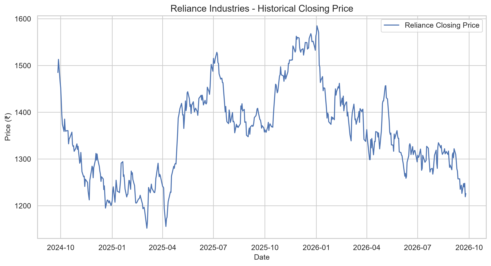
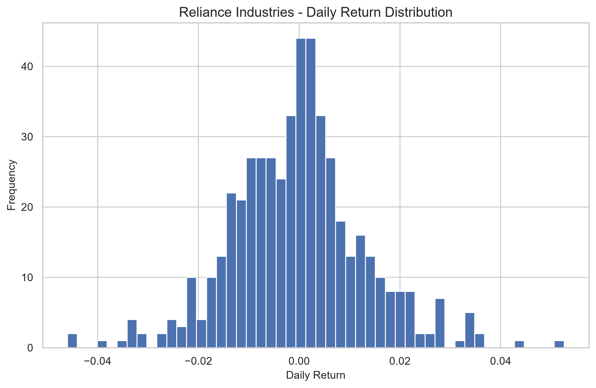

# Black-Scholes Options Pricing & Risk Analysis

<p align="center">
  <b>A Python-based quantitative finance project for European option pricing, risk analysis, sensitivity testing, and historical market-data analysis.</b>
</p>

---

## 📌 Project Overview

This project implements the **Black-Scholes model** for pricing European Call and Put options and analyzes how option values and risk measures respond to changes in key financial variables.

The project combines:

- Quantitative finance
- Python programming
- Mathematical modeling
- Option Greeks
- Sensitivity analysis
- Historical market data
- Data visualization
- Model validation

Historical market data from **Reliance Industries Limited (`RELIANCE.NS`)** is also incorporated to estimate annualized historical volatility and generate a market-data-driven theoretical option valuation.

---

## 🎯 Objectives

The main objectives of this project are to:

- Implement the Black-Scholes pricing model from scratch.
- Calculate theoretical European Call and Put prices.
- Calculate the five major option Greeks.
- Validate the implementation using Put-Call Parity.
- Analyze option sensitivity to:
  - Underlying price
  - Volatility
  - Strike price
  - Time to maturity
- Estimate historical volatility using real market data.
- Use market-derived inputs in the Black-Scholes model.
- Create financial visualizations for pricing and risk analysis.
- Build a reusable Python pricing engine.

---

## 🛠️ Tech Stack

| Technology | Purpose |
|---|---|
| **Python** | Core implementation |
| **NumPy** | Numerical calculations |
| **SciPy** | Statistical functions and normal distribution |
| **Pandas** | Data manipulation and analysis |
| **Matplotlib** | Data visualization |
| **Seaborn** | Statistical visualization |
| **yfinance** | Historical market data |
| **Jupyter Notebook** | Analysis and experimentation |
| **Git & GitHub** | Version control and project management |

---

# 📐 Black-Scholes Model

For a European Call option:

\[
C = S N(d_1) - K e^{-rT}N(d_2)
\]

For a European Put option:

\[
P = K e^{-rT}N(-d_2) - S N(-d_1)
\]

where:

- \(S\) = Current underlying asset price
- \(K\) = Strike price
- \(T\) = Time to maturity
- \(r\) = Risk-free interest rate
- \(\sigma\) = Volatility
- \(N(.)\) = Cumulative standard normal distribution

The intermediate variables are:

\[
d_1 =
\frac{\ln(S/K)+(r+\sigma^2/2)T}
{\sigma\sqrt{T}}
\]

\[
d_2 = d_1-\sigma\sqrt{T}
\]

---

# 📊 Option Greeks

The project calculates the major Black-Scholes risk sensitivities.

| Greek | Meaning |
|---|---|
| **Delta** | Sensitivity of option price to changes in the underlying price |
| **Gamma** | Sensitivity of Delta to changes in the underlying price |
| **Vega** | Sensitivity of option price to changes in volatility |
| **Theta** | Sensitivity of option price to the passage of time |
| **Rho** | Sensitivity of option price to changes in interest rates |

These measures are used to understand the different sources of option risk.

---

# ✅ Model Validation

The implementation was validated using **Put-Call Parity**:

\[
C-P=S-Ke^{-rT}
\]

### Base Test Case

| Parameter | Value |
|---|---:|
| Spot Price | ₹2,500 |
| Strike Price | ₹2,500 |
| Time to Maturity | 1 year |
| Risk-Free Rate | 6% |
| Volatility | 20% |

### Model Output

| Metric | Result |
|---|---:|
| European Call | ₹274.74 |
| European Put | ₹129.15 |
| d1 | 0.400000 |
| d2 | 0.200000 |

Put-Call Parity was successfully satisfied, validating the pricing implementation.

---

# 📈 Sensitivity Analysis

The project evaluates how option prices and Greeks change when important model parameters are varied.

## 1. Underlying Price

As the underlying asset price changes:

- Call value generally increases.
- Put value generally decreases.
- Call Delta changes with the moneyness of the option.
- Gamma is concentrated around the at-the-money region.



---

## 2. Volatility

The project analyzes the impact of changing volatility on option valuation.

Key observation:

- Higher volatility generally increases both Call and Put values.
- Vega measures the sensitivity of option value to volatility.



---

## 3. Strike Price

Changing the strike price affects the intrinsic and time value of options.

Key observation:

- Call value generally decreases as strike price increases.
- Put value generally increases as strike price increases.



---

## 4. Time to Maturity

The project studies the relationship between maturity and theoretical option value.

Key observation:

- Greater maturity generally increases the time value available to European options.
- Theta captures the effect of the passage of time.



---

# 📉 Historical Market Data Analysis

Historical market data for **Reliance Industries Limited (`RELIANCE.NS`)** was retrieved using `yfinance`.

The analysis includes:

- Historical adjusted closing prices
- Daily returns
- Daily volatility
- Annualized historical volatility
- Return distribution
- Market-data-based Black-Scholes valuation

Annualized historical volatility was estimated using:

\[
\sigma_{annual} =
\sigma_{daily}\sqrt{252}
\]

where 252 represents the approximate number of trading days in a year.

### Historical Price



### Daily Return Distribution



---

# 💹 Market-Based Black-Scholes Analysis

The latest observed Reliance Industries price was used as the underlying spot price.

For demonstration, the model uses:

- Latest observed price → Spot Price
- Spot Price → Strike Price
- 1 year → Time to Maturity
- 6% → Risk-Free Rate
- Historical annualized volatility → Volatility input

This represents an approximately **at-the-money theoretical option valuation**.

> **Note:** This is a theoretical Black-Scholes valuation and should not be interpreted as an observed market option price.

---

# 🔍 Key Findings

The analysis demonstrates several important relationships:

### Underlying Price
Call and Put values respond differently to changes in the underlying asset price.

### Volatility
Increasing volatility generally increases the value of both Calls and Puts because greater uncertainty increases the potential range of future payoffs.

### Strike Price
Higher strike prices generally reduce Call values and increase Put values.

### Time to Maturity
Additional time generally increases the opportunity for favorable price movements and therefore contributes to option time value.

### Gamma
Gamma is concentrated around the at-the-money region, indicating greater sensitivity of Delta in this region.

### Vega
Vega quantifies the impact of changes in volatility on option prices.

---

# 🧪 Project Workflow

```text
Historical Market Data
        │
        ▼
Data Cleaning
        │
        ▼
Daily Returns
        │
        ▼
Historical Volatility
        │
        ▼
Black-Scholes Inputs
        │
        ▼
Call / Put Pricing
        │
        ├───────────────┐
        ▼               ▼
     Greeks       Sensitivity Analysis
        │               │
        └───────┬───────┘
                ▼
        Visualizations
                │
                ▼
       Final Analysis